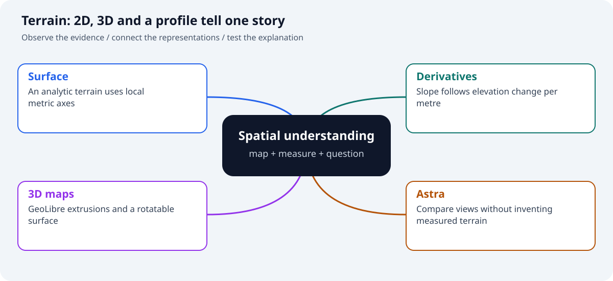

# GeoLibre + GeoAI in JupyterLite

This book is a set of **live, browser-native geospatial labs**. Each chapter can be read as documentation or launched into a writable JupyterLite session with no local Python installation.

**Launch the lab:** [https://jltobias.github.io/JupyterLite-GeoLibre-GeoAI/lite/lab/index.html](https://jltobias.github.io/JupyterLite-GeoLibre-GeoAI/lite/lab/index.html)

## Notebook gallery

| Lab | Focus | Launch |
|---|---|---|
| GeoLibre quickstart | GeoLibre map, GeoJSON, COG | [Open live](https://jltobias.github.io/JupyterLite-GeoLibre-GeoAI/lite/lab/index.html?path=00_geolibre_quickstart.ipynb) |
| WorldPop + H3 | Population, PMTiles, hex indexing | [Open live](https://jltobias.github.io/JupyterLite-GeoLibre-GeoAI/lite/lab/index.html?path=01_worldpop_h3.ipynb) |
| Census + GeoAI | Census polygons + browser clustering | [Open live](https://jltobias.github.io/JupyterLite-GeoLibre-GeoAI/lite/lab/index.html?path=02_census_geoai_counties.ipynb) |
| Earth observation GeoAI | Major TOM layers + NASA GIBS browser ML | [Open live](https://jltobias.github.io/JupyterLite-GeoLibre-GeoAI/lite/lab/index.html?path=03_earth_observation_geoai.ipynb) |
| CHIRPS climate | Daily rainfall COG | [Open live](https://jltobias.github.io/JupyterLite-GeoLibre-GeoAI/lite/lab/index.html?path=04_chirps_climate.ipynb) |
| H3 earthquake GeoAI | USGS feed + anomaly detection | [Open live](https://jltobias.github.io/JupyterLite-GeoLibre-GeoAI/lite/lab/index.html?path=05_h3_earthquake_geoai.ipynb) |
| GeoAI compatibility | Browser/full-stack boundary | [Open live](https://jltobias.github.io/JupyterLite-GeoLibre-GeoAI/lite/lab/index.html?path=06_geoai_compatibility.ipynb) |
| STAC Browser catalogs | Four public browsers and their machine-readable APIs | [Open live](https://jltobias.github.io/JupyterLite-GeoLibre-GeoAI/lite/lab/index.html?path=07_stac_browser_catalogs.ipynb) |
| STAC + GeoAI footprints | Cross-catalog metadata features, clustering, and footprints | [Open live](https://jltobias.github.io/JupyterLite-GeoLibre-GeoAI/lite/lab/index.html?path=08_stac_geoai_footprints.ipynb) |
| GeoLibre demo recommender | Explainable text similarity over official demo themes | [Open live](https://jltobias.github.io/JupyterLite-GeoLibre-GeoAI/lite/lab/index.html?path=09_geolibre_demo_recommender.ipynb) |
| Sister Cities graph GeoAI | Network roles and unusual connectivity profiles | [Open live](https://jltobias.github.io/JupyterLite-GeoLibre-GeoAI/lite/lab/index.html?path=10_sister_cities_graph_geoai.ipynb) |
| Wildfire + STAC triage | Fire-perimeter anomaly scoring and Sentinel-2 discovery | [Open live](https://jltobias.github.io/JupyterLite-GeoLibre-GeoAI/lite/lab/index.html?path=11_wildfire_stac_triage.ipynb) |

## New visual reasoning labs

| Lab | Focus | Launch |
|---|---|---|
| Astra spatial copilot | Question → validated plan → mapped selection | [Open live](https://jltobias.github.io/JupyterLite-GeoLibre-GeoAI/lite/lab/index.html?path=12_astra_spatial_copilot.ipynb) |
| Astra vision + change | Image panels, masks and measured evidence | [Open live](https://jltobias.github.io/JupyterLite-GeoLibre-GeoAI/lite/lab/index.html?path=13_astra_vision_change.ipynb) |
| Astra + 3D terrain | Contours, slopes, profiles and interactive 3D | [Open live](https://jltobias.github.io/JupyterLite-GeoLibre-GeoAI/lite/lab/index.html?path=14_astra_terrain_3d.ipynb) |
| Astra accessibility tools | Networks, counterfactuals and sensitivity | [Open live](https://jltobias.github.io/JupyterLite-GeoLibre-GeoAI/lite/lab/index.html?path=15_astra_network_accessibility.ipynb) |

The enhanced labs pair maps with concept diagrams, charts or graphs, followed by an experiment that changes an assumption. Read the static book for diagrams and saved Astra-lab figures; launch JupyterLite to manipulate data and create live GeoLibre maps. The new labs use deliberately synthetic teaching data so you can test an explanation against known values before applying the workflow to observations.

| Your question | Suggested path | What to compare |
|---|---|---|
| How does location become an analytical feature? | 00 → 01 → 02 → 12 | Coordinate map, H3 scale, feature space, selected cells |
| What changed in an image? | 03 → 08 → 13 | Appearance, footprints, masks, confusion counts |
| What does terrain shape reveal? | 00 → 14 | Contours, slopes, profile, 3D perspective |
| What happens when a connection disappears? | 12 → 15 | Graph topology, routes, cutoff and speed sensitivity |

Labs 12–15 run their analysis without an API key. Optional Astra requests are exported as JSON and sent by the repository's CPython runner; credentials stay outside the static browser site. Each lab explains how to import and inspect a real response. Hand-authored offline examples are labeled, and geospatial measurements are calculated in code.

## GeoLibre's JupyterLite boundary

The upstream `geolibre.Map` widget serves its bundled application from a kernel-side localhost HTTP server. That is appropriate in a normal Jupyter environment, but a Pyodide/WebAssembly kernel cannot bind the required TCP socket.

For that reason, the live labs use `geolibre_lite.LiteMap`, a small browser adapter included with the notebooks. It uses **GeoLibre's own project/layer builders** and the **GeoLibre hosted viewer's embed/postMessage protocol**, so GeoJSON, COG, PMTiles and GeoLibre symbology are still represented as GeoLibre projects without attempting to start an OS-level server.

Use upstream `geolibre.Map` directly when running the notebooks in a full CPython/Jupyter environment with a local server or supported Jupyter proxy.

## A practical interpretation of “GeoAI in JupyterLite”

The full `geoai-py` package is designed for advanced workflows including deep-learning segmentation, detection, classification, change detection, and model training. Its dependency graph includes PyTorch and TorchGeo. JupyterLite runs CPython compiled to WebAssembly through Pyodide, so not every native/GPU dependency is available.

These labs therefore use the **browser-native subset of the GeoAI workflow**: cloud data discovery, spatial feature engineering, H3 indexing, raster processing, scikit-learn modeling, anomaly detection, and interactive mapping in GeoLibre. The Earth-observation lab keeps Major TOM COGs in GeoLibre but uses NASA GIBS JPEG imagery for Python-side clustering so Pyodide does not depend on a missing GDAL ZSTD codec. The compatibility chapter shows where to hand the same data and concepts to full GeoAI on a desktop, cloud VM, Binder/Hub, or GPU notebook.

## Data ethics and reproducibility

The notebooks use public data and avoid hidden credentials. All sources, licenses, fixed example dates, mirrors, and citation guidance are collected in the repository's `DATA_SOURCES.md` and repeated in the relevant lab.
